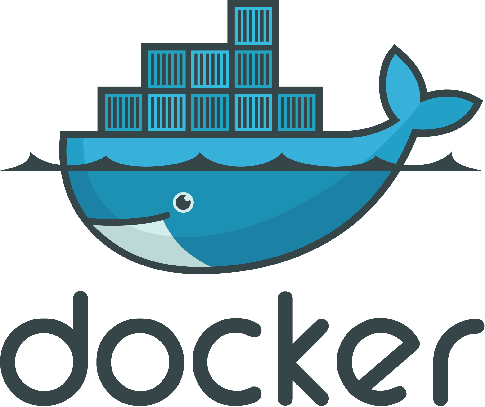

# Hello World! 👋

I am Raj - a curious software engineer!

 

<!--- 

--->

## About me 😀

I hold a Master's degree in Computer Science from [North Carolina State University](https://www.csc.ncsu.edu/). During my Master's, I had the privilege to contribute as a Graduate Research Assistant at [Innovative Educational Computing Lab](https://www.ieclab.org/) at my university. I am experienced in various domains in computer science ranging from software development to machine learning!

## Technologies I have worked with 🔭

<!--

-->

  

  

  

  

  

<!--
## My resume👨🏻‍💻
 Click [***here***](https://drive.google.com/file/d/1FsobfwzkIAzmpHJwqPElDkBoOGEr8KpU/view?usp=sharing) for my latest resume.
-->

## Let's talk! 💬

If you are looking to work with someone who loves coding and innovate products, or just want to talk about tech, let's connect!

## Reach me at 👯
[][Gmail]

[][LinkedIn]

[][Wordpress]

[Gmail]: mailto:rksmail20@gmail.com
[LinkedIn]: https://www.linkedin.com/in/rajshrivastava/
[Wordpress]: https://rajshrivastava.wordpress.com/

<!--
**rajshrivastava/rajshrivastava** is a ✨ _special_ ✨ repository because its `README.md` (this file) appears on your GitHub profile.

Here are some ideas to get you started:

- 🔭 I’m currently working on ...
- 🌱 I’m currently learning ...
- 👯 I’m looking to collaborate on ...
- 🤔 I’m looking for help with ...
- 💬 Ask me about ...
- 📫 How to reach me: ...
- ⚡ Fun fact: ...
-->
